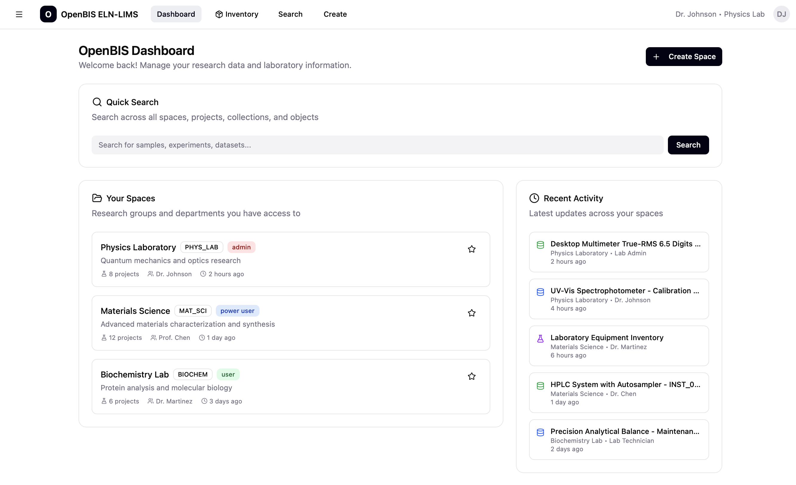
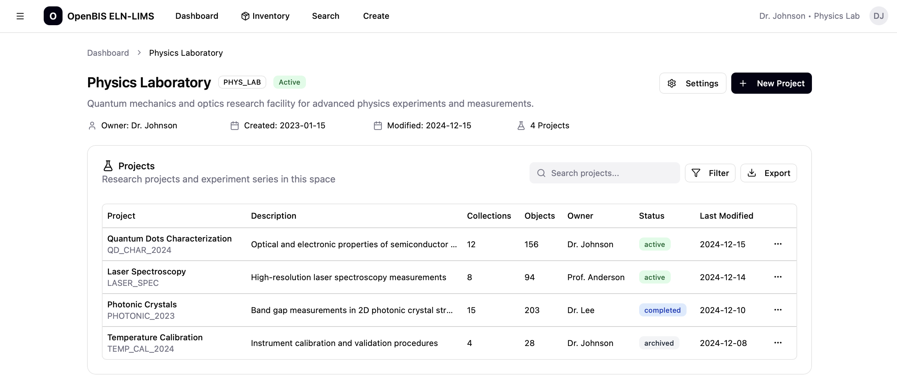
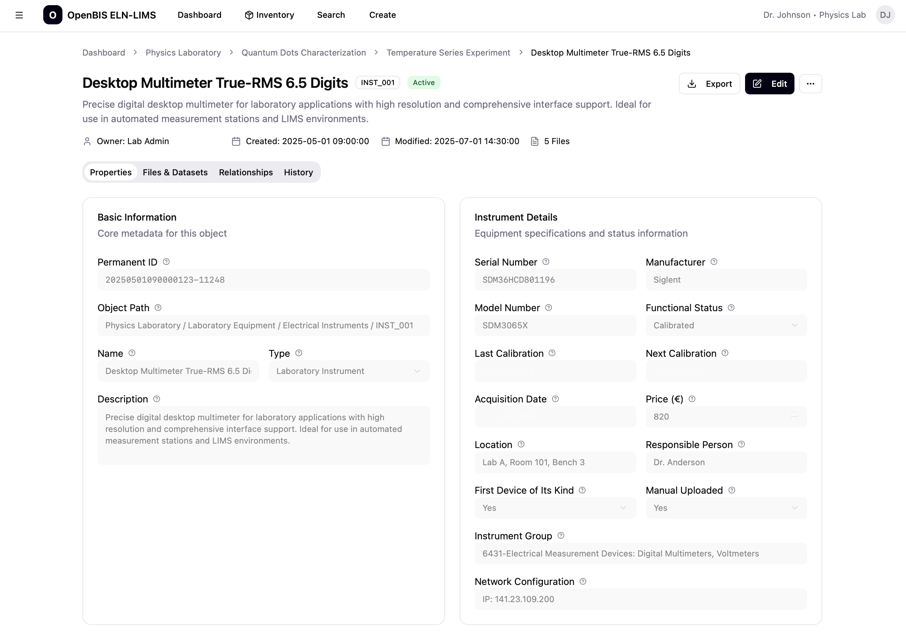

# NextLaBIS

NextLaBIS is an initiative to modernise the openBIS electronic lab notebook (ELN) and laboratory information management system (LIMS) experience with a fast, accessible, and customisable web interface. The project is currently in its foundation phase with a Next.js application scaffold, Mantine as the component library, and a growing library of reusable masterdata components that mirror the data types exposed by openBIS.

The repository is intentionally open and collaborative. While the maintainer is not a full-time software engineer, the goal is to partner with the community to shape an implementation that can be proposed to the official openBIS development team.

## Project Goals

- Deliver a modern UI/UX for openBIS with responsive design, dark-mode friendly palettes, and streamlined navigation.
- Provide configurable masterdata templates that cover the breadth of openBIS object types.
- Enable laboratory teams to manage projects, objects, and datasets with intuitive workflows.
- Maintain a transparent roadmap organised by phases / epics to guide contributors.


_Example dashboard mockup showcasing a clean, card-based layout._


_Example project view mockup with tabbed navigation and data tables._


_Example object detail mockup featuring metadata and related datasets._

## Current Status

- **App shell**: A Next.js 15 application scaffold using the App Router and TypeScript.
- **Component library**: Early masterdata components (e.g., boolean, integer, vocabulary) that will be combined into reusable templates for object creation/editing.
- **Design system**: Mantine components with Tabler icons configured for rapid prototyping.
- **Roadmap**: Phase planning captured in [`docs/project-management.md`](docs/project-management.md) with open issues acting as epics and sub-issues.

## Quick Start

1. Install Node.js 20+.
2. Install dependencies: `cd nextapp && npm install`.
3. Run the development server: `npm run dev`.
4. Visit [http://localhost:3000](http://localhost:3000) to explore the app shell.

See [`nextapp/README.md`](nextapp/README.md) for detailed environment instructions.

## Repository Structure

```
NextLaBIS/
├── docs/                  # Project documentation and processes
├── nextapp/               # Next.js application
│   ├── public/            # Static assets
│   ├── src/               # Application source code
│   └── package.json       # App dependencies and scripts
├── .github/               # Issue templates and GitHub configuration
└── README.md              # You are here
```

## Documentation Overview

- [`docs/tech-stack.md`](docs/tech-stack.md): Frameworks, libraries, and tooling in use.
- [`docs/coding-standards.md`](docs/coding-standards.md): Guidelines for TypeScript, React, styling, and testing.
- [`CONTRIBUTING.md`](CONTRIBUTING.md): How to propose changes, submit issues, and open pull requests.
- [`docs/branching-strategy.md`](docs/branching-strategy.md): Git workflow and release strategy.
- [`docs/project-management.md`](docs/project-management.md): Explanation of phases, epics, labels, and sub-issues.
- [`CODE_OF_CONDUCT.md`](CODE_OF_CONDUCT.md): Expected behaviour across the community.

## Contributing

Contributions of any size are welcome—from documentation updates to full features. Please review the [Code of Conduct](CODE_OF_CONDUCT.md), [Contributing guide](CONTRIBUTING.md), and [project management workflow](docs/project-management.md) before getting started. Open issues labelled with `good first issue` or belonging to the current phase are ideal starting points.

If you have ideas or need help navigating the repository, open a discussion or reach out via issue comments. All feedback is valuable.

## About openBIS

[openBIS](https://openbis.ch/) is an open-source data management system for academic and industrial research. It offers structured data organisation, access control, and integration with scientific workflows. NextLaBIS aims to complement openBIS with a refreshed, intuitive frontend tailored for modern lab operations.

---

Thank you for your interest in NextLaBIS. Let’s build a flexible, researcher-friendly interface together!
